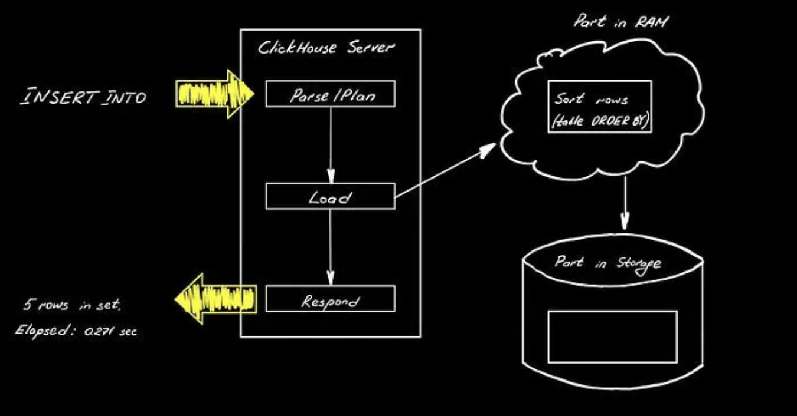
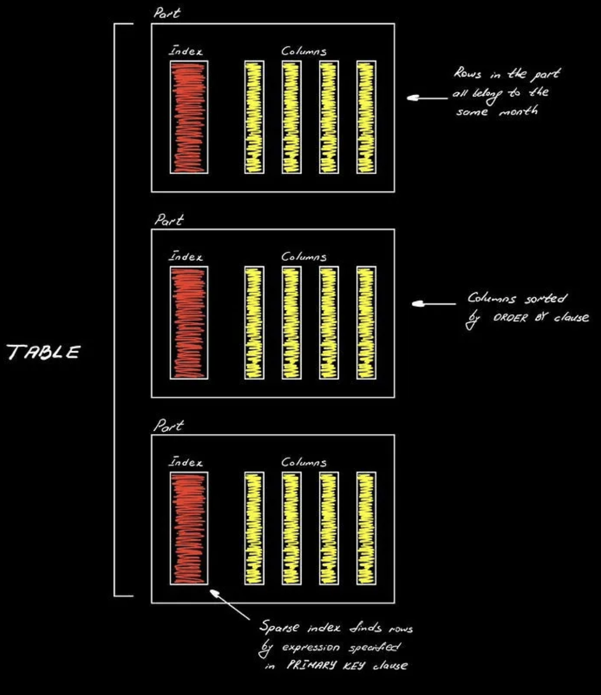
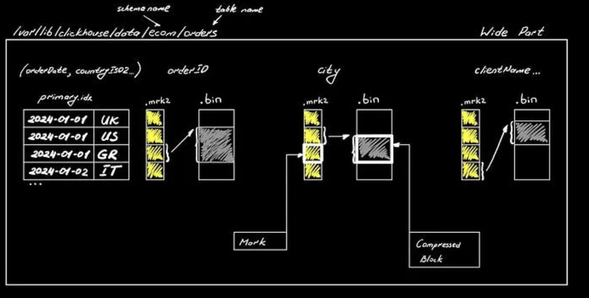
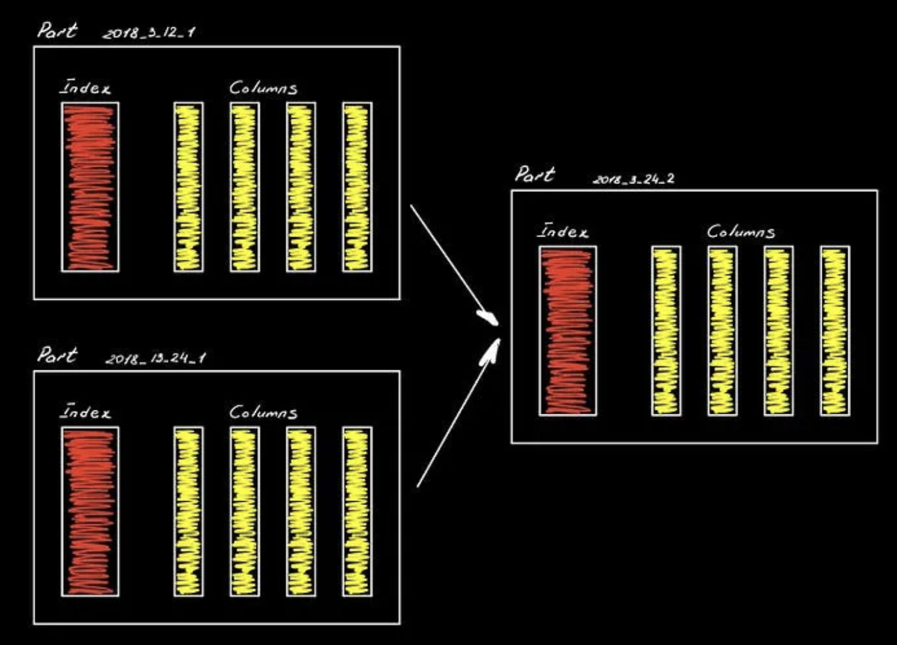
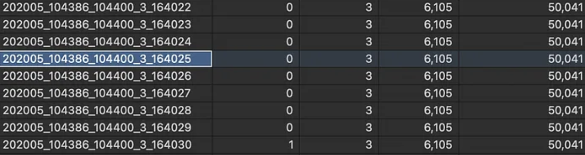
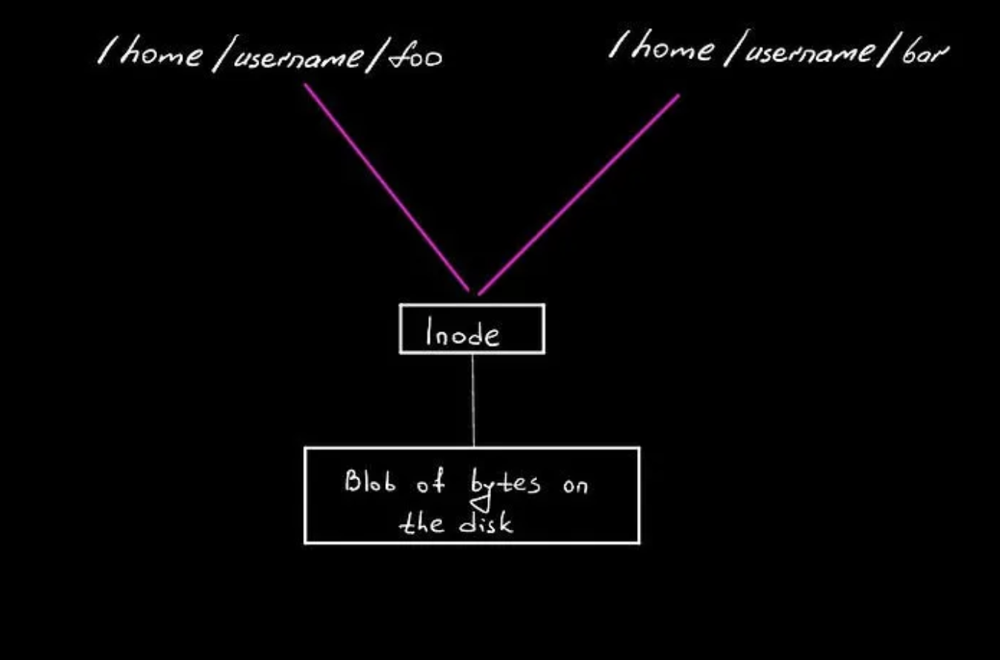
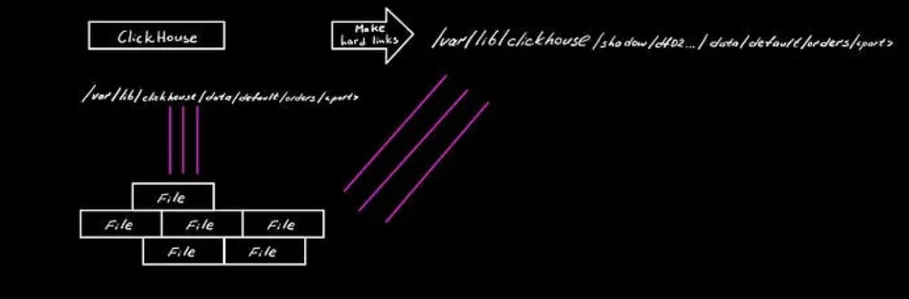
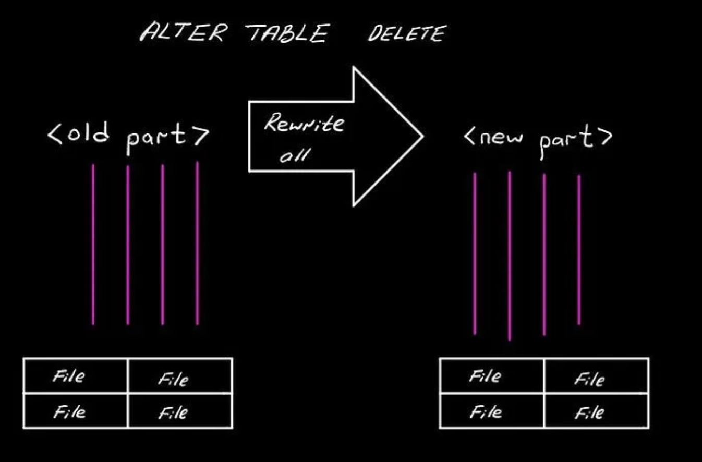
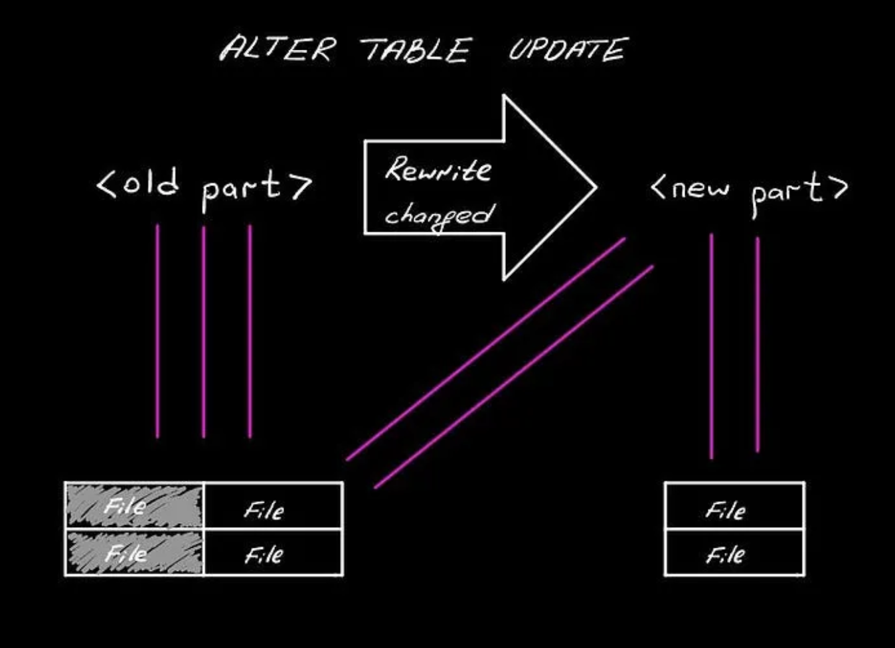

# Inner Workings of ClickHouse

## Introduction

ClickHouse is popular open-source OLAP system suitable for ad-hoc and real-time analytics.
If everything is setup correctly in terms of preaggregates and table structure, the user can expect the results of complex aggregating queries in a matter of seconds or even milliseconds. To make it possible, ClickHouse, first of all, stores data in a columnar fashion on a disk, as any modern Data Warehouse and also good at parallelizing execution using vectorized instructions on Intel CPUs architecture.

## MergeTree table engine

ClickHouse has many types of table engines: it can fetch data directly from Kafka with **Kafka Table Engine**, it can store data in-memory with **Memory Table Engine**, it can maintain **Dictionaries** (quick in-memory lookups), etc. These are, essentially, different types of table engines that allow access data, but we’ll focus entirely on the **MergeTree Table Engine**. It has variants: for example, **AggregatingMergeTree**, **ReplicatedMergeTree**, etc. Under the cover, at the storage level, they all behave essentially the same way, hence what we’ll learn here applies to all these table types.

### Typical DDL:

```
CREATE TABLE default.orders
(
    `year` UInt16,
    `quarter` UInt8,
    `orderID` UInt16,
    `city` String,
    `clientName` String,
    `orderDate` DateTime,
    `createdAt` DateTime,
    `productName` String
    ...
)
ENGINE = MergeTree
PARTITION BY (year, quarter)
PRIMARY KEY orderID
ORDER BY orderDate
SETTINGS index_granularity = 8192;
```

MergeTree tables need the guidance on how to break data into pieces, as these tables can be large. So, we give ClickHouse a hint on what’s the most obvious way to break things up via the PARTITION BY block. In our example it's combination of year and quarter (maybe our table will be used to generate quarterly reports). PRIMARY KEY is basically a way to locate the data: it's a sparse index (to fit in-memory for fast execution), where each entry points at the beginning of the block of rows, which size is specified via index_granularity setting (in our example: at every 8192d record in the orderID column). Ordering is critical in columnar databases, because it affects what data is contiguous: what rows are placed together with other rows on disk. It makes a huge difference in the query execution as it can reduce the amount of data we scan, by allowing ClickHouse skip blocks of data, especially in the case of a range queries (WHERE orderDate BETWEEN '2024-01-01' AND '2024-02-01'). Also, it has a profound effect on the compression and hence the storage.

## INSERTs



ClickHouse parses the query and does certain amount of planning, but not much, as it doesn’t have query-based optimizer that performs cost-based plan comparison (opposed to InnoDB of MySQL). But it can split the work that needs to be done. When we load the data, we construct a so-called part fully in RAM, in a way it'll be represented on the disk: sorted according to the ORDER BY clause and compressed. The last part is that we get the respond from the server.

The actual table will then consist of a collection of such parts:



## Storage Level

We’ve covered how the part of data is processed during INSERT, but what happens at the level of storing them?



Inside, the table data divided into parts, that live within a partition defined by the PARTITION BY clause. This is essentially a way of using something in the table to split everything up into a reasonable chunks of data, so that ClickHouse would be able to create a set of parts that tend to be about the same size across all partitions. All the rows in any individual part will belong to the same year-quarter combination. Columns are sorted by columns we specified in the ORDER BY clause and we have a sparse index to quickly locate rows by values in the columns we specify in the PRIMARY KEY clause (on the image above it's orderDate and countryISO2). This index should consist of fewer number of columns if possible, so that it could fit in-memory. If we don't specify it, then ClickHouse would replicate ORDER BY clause (that we might make very long) to PRIMARY KEY clause.

Now let’s look at the composition of the part itself. What’s interesting about ClickHouse is that you can go to the server and literally see the files on the disk that represent your data, as opposed to other database engines. We can find separate directories with the names of our databases, tables and parts within them. Here, we have an example of a wide part .

Note on compact parts: for parts that don’t have much data CH maintains them with smaller number of files, so that it doesn’t need to keep a lot of file descriptors

Wide parts have 2 files for each column: .mrk2 is the index (called mark) that points at the start of each compressed block of data to quickly locate these blocks in each column based on the expression in the PRIMARY KEY.

```
ls -l /var/lib/clickhouse

# output

...
```

By default ClickHouse storage lives under /var/lib/clickhouse . There're a lot of folders, but we're mainly interested in data, that has the actual data parts, metadata, that stores SQL definitions and store to also stores the data (we'll cover it later).

## Why MergeTree? Because it merges!



Every time you run an INSERT , ClickHouse generates part, but if we just leave it like that, it would be bad. Small parts are inefficient for queries. Wide Part itself has a lot of files in it (2 for each column plus some overhead) and each of them consumes Inodes (it takes time to open and traverse the file). Hence, as soon as we insert stuff, ClickHouse begins the process of merging data in background. There's a MergeSelector process that periodically scans all tables, chooses parts that are needed to be merged according to its algorithm and schedules the merge. Then the MergeExecutor process does the actual merge. During the merge ClickHouse brings both parts into RAM to create a new part with updated suffix number specifying the number of merges being performed, sort them and flush to the disk. As the result file system will have the doubled amount of data on the disk for some time until the original parts are marked as inactive and wiped out automatically. So, the server should always have the extra disk space to allow the merge to take place.

```
SELECT name, active, level, rows, bytes_on_disk
FROM system.parts
WHERE database = 'default' AND table = 'orders'
```



Here, by querying the system.parts table, we can find the current state of this merging process: parts name on the disk, which ones are active, how many merges happened, number of rows and size in bytes.

## Hard Links

Hard links are what ClickHouse uses to play these tricks and move things around quickly.

```
$ echo "hello world" > bar
$ ln foo bar
$ ls --inode foo bar
4260300 bar 4260300 foo
$ cat bar
hello world
$ rm foo
$ ls --inode bar
4260300 bar
```



Files themselves are just blobs of data on a disk and they’re stored using Inodes. So, when you construct a file on Linux, is just creates a hard link to the Inode that represent the actual data on the disk. Thus, we can have multiple files pointing to the same data on the disk and deleting a file simply means deleting a hard link to the Inode. Until there’s at least 1 hard link to the Inode, the actual content won’t be deleted from the disk, hence deleting one file won’t wipe out another, if they refer to the same data on the disk.



Another place, where the properties of hard links are used under the hood, is the command ALTER TABLE FREEZE for creating stable snapshots of data. It creates the directory representing your table under the path /var/lib/clickhouse/shadow that's not going to store the actual data, but will store the hard links to the original parts. From this point ClickHouse can go its way: merging parts into new ones and deleting original ones, but, as we now have multiple hard links to the part, ClickHouse won't actually delete them, just drop the hard links to the Inodes that represent parts.

This command is commiting to storage and, as long as this shadow directory exists, the underlying files won’t get deleted and they’ll continue book space on a disk, even though ClickHouse won’t be aware of them. ALTER TABLE UNFREEZE will do the work of dropping these additional hard links and let the system do the actual cleanup of data from the disk.

Note on Inode limits: Inode is the limited resource on any UNIX-based system, so we need to be careful with the FREEZE command. We can run out of Inodes if we end up with a lot of stuck files forgetting to run UNFREEZE. Or if, for some reason, we end up with ridiculous number of small parts.

## Manipulating data within parts

We can also make changes to the actual data within the parts via running mutations, that can be very heavy. For example, ALTER TABLE DELETE will delete rows from the parts asynchronously as the background operation. Even though the response after running it is almost instant, it can generate a lot of IOPs, as ClickHouse has no other choice, but to rewrite the whole part (it needs to delete the entire row).



ClickHouse was designed for storing time ordered data, so the idea is that you won’t need to perform such operations very often, plus there other techniques to alter the data without running the mutations: ReplacingMergeTree or CollapsingMergeTree to handle deletes or updates via INSERT statements (where ClickHouse actually shines).

ALTER TABLE UPDATE is a similar operation but it'll affect only specific columns and, hence, there's no need to open each and every file within a part.



ClickHouse is pretty clever with UPDATE: it’ll create new files for the updated columns and construct a new part by creating the hard links to these new files, only dropping hard links to the old files, leaving others unchanged. So, there’s not much of unnecessary actions.

Even though such mutation operations will return the success response almost instantly, the actual work will be done in the background. If we want to check the status of the mutation we can run queries against system.mutations table. There might be the case that some heavy mutation slows down the server and we want to stop it. This is possible via KILL MUTATION command.