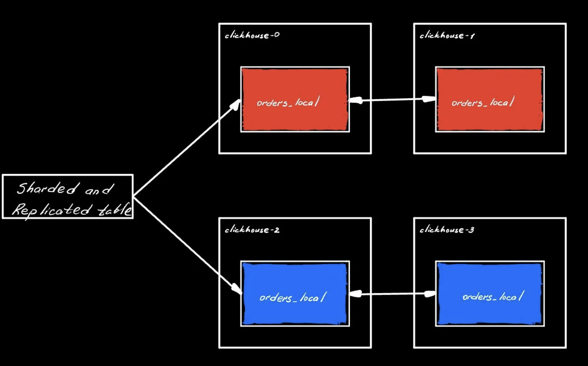
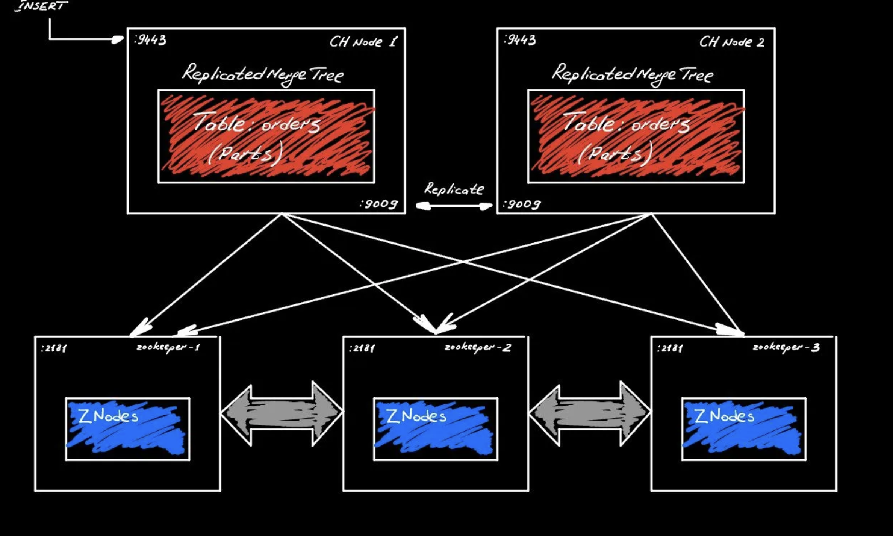
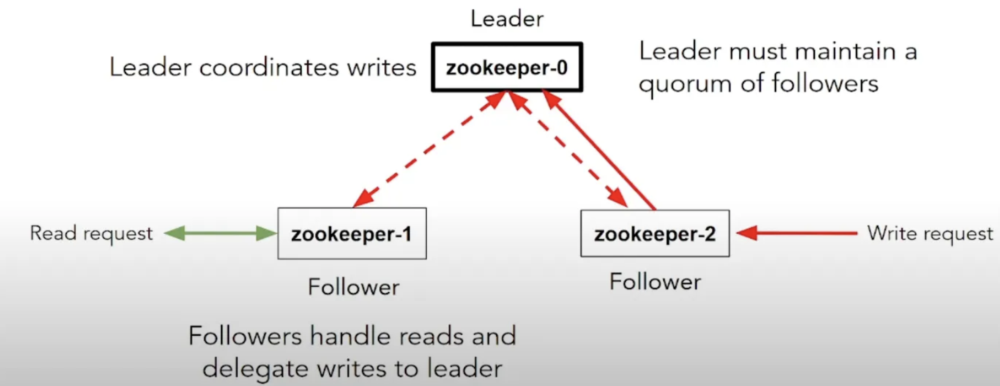
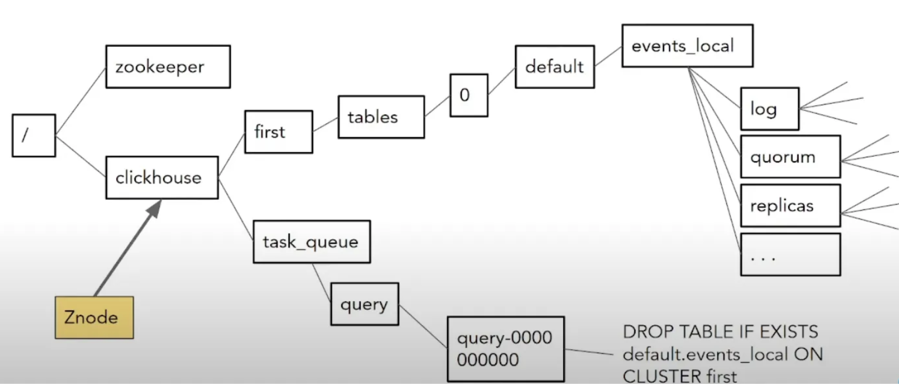

# ZooKeeper

A good thing about ClickHouse is that it’s like any other database — you just spin up a single process and you good to go for ad-hoc analytics or real-time data processing. When we bring ZooKeeper, it’s an extra component that we need to manage (configuring extra cluster, installing JAVA, etc). Why do we need this?

## Why does ClickHouse needs ZooKeeper?

Horizontal scaling (spreading data across many servers over the network) is a key to ClickHouse performance.



Image above shows 2 shards (red and blue) with a couple of replicas. This means we can take advantage of the processing capabilities of several machines: scale reads with replicas and scale writes, because we aren’t dependent on the IO capacity of a single machine. This is a fundamental reasons for horizontal scaling.

Replication and sharding is done on a table level, as can be seen in the example DDL:

```
CREATE TABLE IF NOT EXISTS `orders_local` ON CLUSTER '{cluster}' ( -- run DDL on all nodes within the cluster
  OrderDate DateTime,
  OrderID UInt32,
  ItemID UInt32,
  ...
)
Engine=ReplicatedMergeTree(
  '/clickhouse/{cluster}/tables/{shard}/{database}/orders_local', -- {} store macroses
  '{replica}'
)
PARTITION BY toYYYYMM(OrderDate) -- physically split the data on disk based on expression
ORDER BY (OrderID, OrderDate) -- physically sort the data on disk for faster serches

INSERT INTO orders_local(...) VALUES
(now(), 1, 762), (now(), 2, 856)
```

In distributed systems many things can go wrong:

ON CLUSTER command failed on one node.
Two replicas merge overlapping parts.
Node offline for maintenance; missed the memo.
Two replicas delete overlapping parts.
These are all distributed consensus problems. We need a mechanism for all of the nodes to agree on the proper state of the system. That’s exactly what Zookeeper does. It stores all the ON CLUSTER commands that need to be executed in a specific order, it keeps track of every thing that needs to be replicated (parts) and order of their merges.



Zookeeper nodes talk to each other via ZAB protocol (to maintain consistency in a distributed system). Clients dial in on port 2181 to get a consistent information.



1 out of 3 nodes will become a leader and there’s a process to agree on who’s a leader is (leader election). Write request might arrive to a follower, who will forward this request to the leader. Then leader send this request to all followers (and itself) and makes sure they see and commit it, so that each ZKNode stores the valid replica of the state. You have a single node that ensures that all the messages get sent to everyone in a specific order.

### Performance considerations
Everything is bound to capabilities of a leader node: how fast it can process the incoming messages (CPU and disk IOPs) and how many followers does it need to send data to.

Reads are fast, because they can be handled by any follower.

### ZooKeeper Directory structure for ClickHouse



If you go to zookeeper you’ll see something very similar to a file system. We have a root node and a couple of chains coming off the clickhouse node:

first is the cluster which tracks all the tables: schema structure, replicas, leader elections used to control merges and mutations, log of operations, parts on each replica, last N block INSERTs for deduplication, data to ensure quorum on writes, etc.
task_queue keeps track of the pending and completed ON CLUSTER DDLs
ZNode is like a folder and a file at the same time. It’s not meant for the manual modification, only CH can alter this.

### Ensuring ZooKeeper max speed and availability

- Dedicated hosts that aren’t shared with other applications (ClickHosue is designed to consume everything it sees to make a job done, which can kill the ZooKeeper if it runs on the same node)
- ZooKeeper logs need to be stored on the performant disk (dedicated SSD)
- Low network latency between nodes (because they need to communicate)
- At least 4 GB RAM (When it runs it maintains the copy of ZNodes in RAM.)
- Disable swap (remove entry from /etc/fstab so that ZK don’t read from storage)
- Tune java heap to use as much ram as possible


